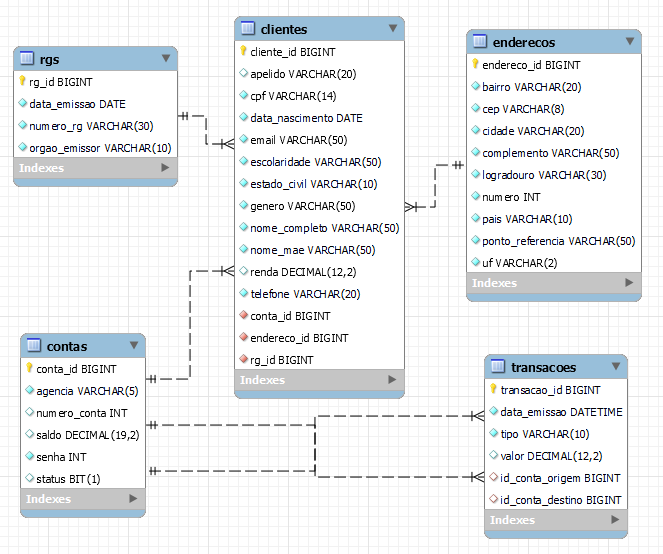
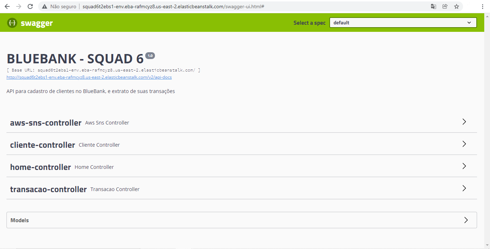
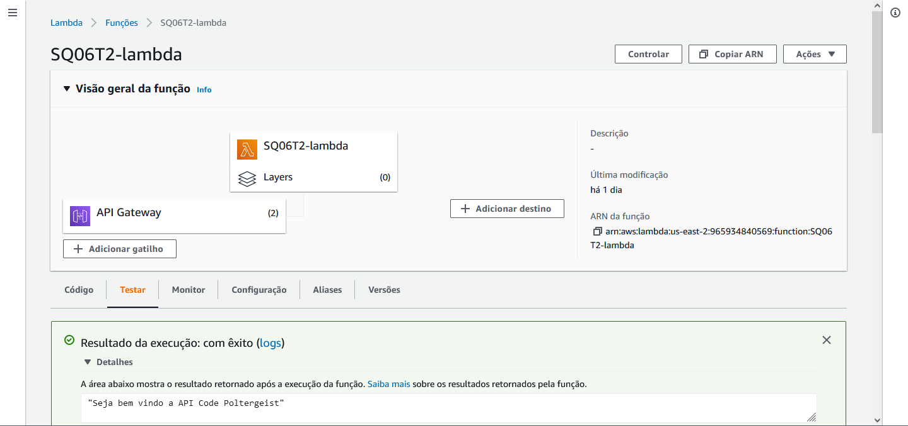

<div align="center">

# PROJETO BLUE BANK 
</div>
O projeto Blue Bank é uma API REST de um banco, desenvolvido em Java com o framework Spring Boot e serviços da AWS Cloud. Além disso, é o desafio final do PAN Academy, um curso de formação Java e AWS Cloud, com duração de 10 semanas oferecido pela Gama Academy e pelo Banco PAN.

---
### 👻 Equipe Code Poltergeist:

- Guilherme Nunes
- Mariana Fonseca
- Miromar Junior
- Vinicius Menolli
- Jessica Kopps

---
### 📑 Tecnologias e recursos utilizados

- Spring Boot (Maven e JDK 11)
- Banco de Dados Relacional MySQL
- Swagger
- Postman
- Deploy na AWS

- Metodologias Ágeis:
  - Jira (Kanban)

- AWS Cloud:
  - Amazon Simple Notification Service (SNS)
  - API Gateway
  - Elastic BeanStalk
  - Code Pipeline
  - Code Commit
  - Code Build 
  - Lambda
  - RDS 
  - S3

---
### ⚙️ Utilizando a aplicação

- Requisitos:
  - Maven
  - JDK 11
  - MySQL

- Gere o <b>.jar</b> da aplicação executando o comando no terminal:
  ```
  mvn clean install -Dskiptests
  ```
- Caso o código acima não funcione, execute:
  ```
  ./mvnw clean install -DskipTests
  ```

- Para rodar a aplicação, vá até a pasta target do projeto, onde está o arquivo .jar, e rode o comando:
  ```
  java -jar -Dspring.profiles.active=localdebug blue-bank-0.0.1-SNAPSHOT.jar
  ```

---
### 📁 Banco de Dados

- <a target="_blank" href="./db/blueBank6.sql"> Script SQL</a>

- Diagrama de entidade de relacionamento (DER):


---
### 🔌 Endpoints

- URL para acesso local:
  - http://localhost:8080

- URL para acesso na AWS:
  - http://squad6t2ebs1-env.eba-rafmcyz8.us-east-2.elasticbeanstalk.com/
<br>

- Clientes

| Método |  Caminho                     | Uso                       |
| :---   | :---                         | :---                      |
| POST   | <BASE_URL>/cliente/salvar            | Cadastrar cliente         |
| PUT    | <BASE_URL>/cliente/atualizar/{id}    | Atualizar dados cadastrados dos clientes por ID|
| GET    | <BASE_URL>/cliente/listar            | Listar todos os clientes cadastrados |
| GET    | <BASE_URL>/cliente/listar/{id}       | Listar clientes pelo ID   |
| GET    | <BASE_URL>/cliente/listar/cpf/{cpf}  | Listar clientes pelo CPF  |
| DELETE | <BASE_URL>/cliente/deletar/{id}      | Deletar clientes pelo ID |
<br>

- Transação 

| Método |  Caminho                     | Uso                       |
| :---   | :---                         | :---                      |
| POST   | <BASE_URL>/transacao/salvar  | Realizar transação. Usar tipo: deposito/transferencia/saque |
| GET    | <BASE_URL>/transacao/listar   | Listar histórico de transações |
<br>

- Amazon Simple Notification Service (SNS):

|  Caminho                        | Uso                                  |
| :---                            | :---                                 |
| <BASE_URL>/addInscricao/{email} | Mandar email para inscrição no SNS    |
| <BASE_URL>/enviarNotificacao    | Mandar notificação para emails cadastrados |
<br>

- API Gateway

| Método |  Caminho                     | Uso                       |
| :---   | :---                         | :---                      |
| POST   | https://8gno5jdvk7.execute-api.us-east-2.amazonaws.com/blueBank/clientes/salvar            | Cadastrar cliente         |
| PUT    | https://8gno5jdvk7.execute-api.us-east-2.amazonaws.com/blueBank/clientes/atualizar/{id}    | Atualizar dados cadastrados dos clientes por ID|
| GET    | https://8gno5jdvk7.execute-api.us-east-2.amazonaws.com/blueBank/clientes/listar            | Listar todos os clientes cadastrados |
| GET    | https://8gno5jdvk7.execute-api.us-east-2.amazonaws.com/blueBank/clientes/listar/{id}       | Listar clientes pelo ID   |
| GET    | https://8gno5jdvk7.execute-api.us-east-2.amazonaws.com/blueBank/clientes/listar/cpf/{cpf}  | Listar clientes pelo CPF  |
| DELETE | https://8gno5jdvk7.execute-api.us-east-2.amazonaws.com/blueBank/clientes/deletar/{id}      | Deletar clientes pelo ID |
| POST   | https://8gno5jdvk7.execute-api.us-east-2.amazonaws.com/blueBank/transacao/salvar  | Realizar transação. Usar tipo: deposito/transferencia/saque |
| GET    | https://8gno5jdvk7.execute-api.us-east-2.amazonaws.com/blueBank/transacao/listar   | Listar histórico de transações |

---
### 🧾 Documentação Swagger UI

- Local
  - http://localhost:8080/swagger-ui.html#

- Pela AWS
  - http://squad6t2ebs1-env.eba-rafmcyz8.us-east-2.elasticbeanstalk.com/swagger-ui.html#


- Swagger imagens

  - [AWS-SNS](https://github.com/GuiiCNunes/BlueBankSquad6/blob/main/assets/img/swagger/swagger-sns.png?raw=true)
  - [Cliente Controller](https://github.com/GuiiCNunes/BlueBankSquad6/blob/main/assets/img/swagger/swagger-clilente-controller.png?raw=true)
  - [Home Controller](https://github.com/GuiiCNunes/BlueBankSquad6/blob/main/assets/img/swagger/swagger-home-controller.png?raw=true)
  - [Transação Controller](https://github.com/GuiiCNunes/BlueBankSquad6/blob/main/assets/img/swagger/swagger-transacao.png?raw=true)
  - [Models](https://github.com/GuiiCNunes/BlueBankSquad6/blob/main/assets/img/swagger/swagger-models.png?raw=true)

---
### ☁️ AWS Cloud

- Lambda

  
  
- AWS imagens

  - [Página Home](https://github.com/GuiiCNunes/BlueBankSquad6/blob/main/assets/img/aws/pagina-home.jpg?raw=true)
  - [Elastic Beanstalk](https://github.com/GuiiCNunes/BlueBankSquad6/blob/main/assets/img/aws/elastic-beanstalk.jpg?raw=true)
  - [API Gateway](https://github.com/GuiiCNunes/BlueBankSquad6/blob/main/assets/img/aws/api-gateway.jpg?raw=true)
  - [SNS](https://github.com/GuiiCNunes/BlueBankSquad6/blob/main/assets/img/aws/sns.jpg?raw=true)
  - [RDS](https://github.com/GuiiCNunes/BlueBankSquad6/blob/main/assets/img/aws/rds.jpg?raw=true)
  - [Code Commit](https://github.com/GuiiCNunes/BlueBankSquad6/blob/main/assets/img/aws/code-commit.jpg?raw=true)
  - [Code Build](https://github.com/GuiiCNunes/BlueBankSquad6/blob/main/assets/img/aws/code-build.jpg?raw=true)
  - [Code Pipeline](https://github.com/GuiiCNunes/BlueBankSquad6/blob/main/assets/img/aws/code-pipeline.jpg?raw=true)
  
---
### 📑 Apresentação do Desafio final
- <a target="_blank" href="./Apresentacao_CODE_POLTERGEIST.pdf"> Confira nossa apresentação</a>
